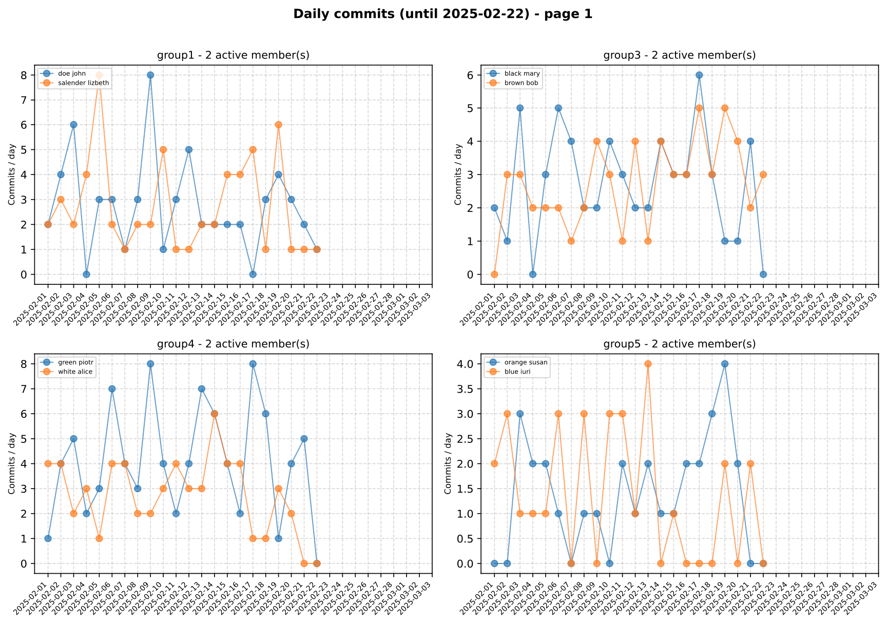

# Git Project Statistics

## Overview

**Git Project Statistics** is a Python tool designed to analyze git repositories from student projects. It generates detailed statistics on commits, lines of code added or removed, and overall activity per group member. This tool is particularly useful for educators and instructors who want to track the progress and collaboration of student groups.



## Features

- **Multi-branch analysis:** Scans all local and remote branches to compile a complete history.
- **Alias mapping:** Unifies author names using a configurable alias mapping to ensure accurate statistics even when students use different usernames.
- **Exclusion mechanism:** Allows you to exclude non-student commits from the statistics (for example instructors' commits).
- **Output formats:** Generates CSV files for global and daily statistics, along with multiple PDF reports:
  - Summary table
  - Activity histogram
  - Balance report
  - Daily charts
- **Configurable parameters:** Easily modify analysis dates, thresholds, and other parameters using a JSON configuration file.

## Use cases

- **Monitoring group activity:** Identify the most active contributors in each group.
- **Project tracking:** Evaluate student participation and contribution trends over the course of the project.
- **Feedback and evaluation:** Provide data-driven feedback to students regarding their collaboration and individual contributions.

## Prerequisites

- Python 3.6 or higher.
- [GitPython](https://gitpython.readthedocs.io/)
- [Matplotlib](https://matplotlib.org/)
- [PyTest](https://docs.pytest.org/en/stable/)

## Getting started

1. **Clone the repository:**  
   Download or clone the project repository to your local machine.

2. **Directory structure:**  
   The project follows a modular structure, with the main code placed in the `src` directory:

   ```default
   git_statistics/
   ├── install_dependancies.sh  # A script to install dependancies 
   ├── LICENSE
   ├── README.md
   ├── requirements
   ├── sample_config.json       # A sample config file
   ├── fake_project_example/    # Contains 5 fake groups with fake git repositories 
   ├── resources/               # Contains PDF produces from the fake_project_example directory
   ├── src/
       ├── config.py
       ├── git_analyzer.py
       ├── main.py
       ├── report_generator.py
       └── utils.py
   └── tests/
   ```

3. **Dependancies installation**  
   The script `./install_dependancies.sh` can be run to install all you need:

   ```bash
   chmod u+x ./install_dependancies.sh
   ./install_dependancies.sh
   ```

4. **Configuration:**  
   Edit the `sample_config.json` file (or create your own configuration file) to define:
   - `excluded_members`: A list of user names to exclude from statistics.
   - `alias_mapping_by_group`: Mappings of various author aliases to a unified name for each group (e.g.: "salender lizbeth" and "lizbeth" is the same person).
   - `fixed_project_start_date`: The start date for your project analysis.

5. **Run analysis:**  
   From the project root directory, run:

   ```bash
   python3 src/main.py --student-folders path/to/student_projects --target-date YYYY-MM-DD
   ```

   Replace `path/to/student_projects` with the directory containing each group's project repository, and `YYYY-MM-DD` with your desired target date (or modify `config.py`).

6. **Outputs:**  
   The tool generates CSV files and PDF reports in the root directory. These outputs provide an overview of each group's activity and can be used for further analysis or reporting.

## Customization

- **Configuration file:** Modify the JSON configuration to adjust alias mappings, excluded members, or the project start date.
- **Thresholds and parameters:** The command-line arguments allow you to customize activity thresholds and analysis duration.

## License

This project is released under the [MIT License](LICENSE).

## Author

Alain Lebret, (c) 2024
